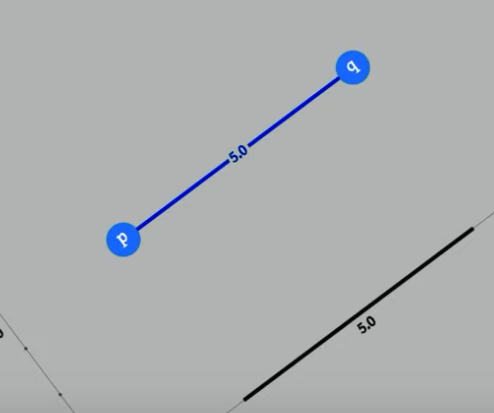
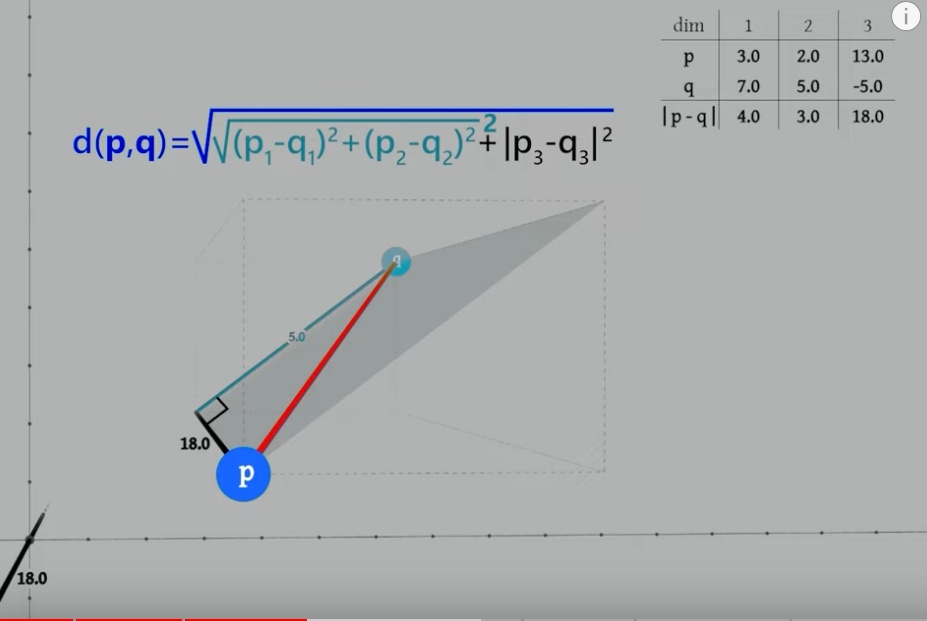
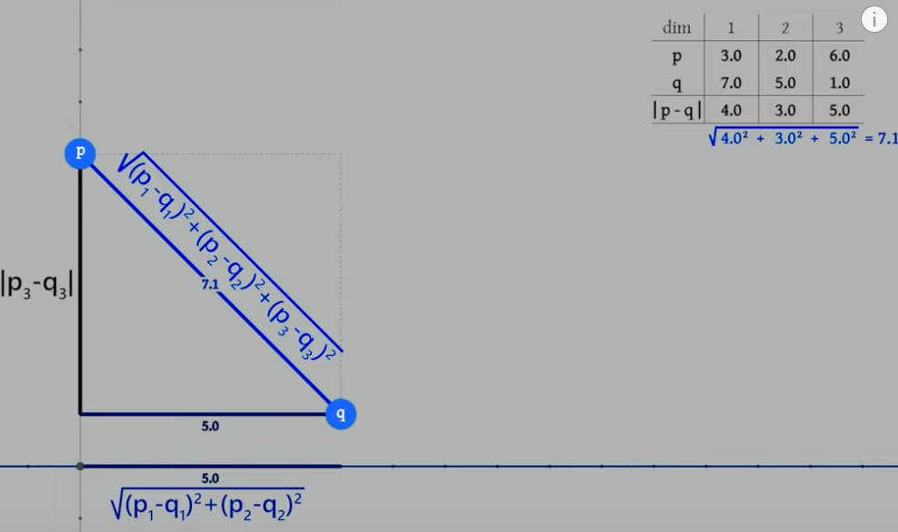
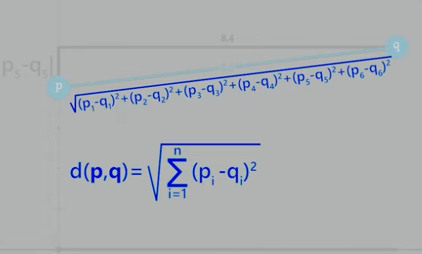

Follow along to the no-black-box machine learning course by @radu on freecodecamp

Raw and derived data is not included in the repo as it doesn't have any license: https://github.com/gniziemazity/drawing-data

# No black box ML Part 1 (Videos 1-9)

Notes:

- methods starting with `#` are private in JS (ES2015+). Never knew.
- When visualizing data and nearest neighbour, be aware that a sample might **look** closer to another sample because the pixelspace in the chart is (or can be) squished together and in dataspace another point might actually be nearer!
- Data scaling:
  - Normalization: remap values to values between 0-1


## Dealing with outliers

- remove
- standardization: calculate mean and standard deviation and subtract mean and divide by standard deviation


## Classifiers

K nearest neighbors (where K is the number of nearest neighbors), where the class is decided on the majority of the k nearest neighbors

## Homework

### 2 new features

- general orientation (e.g. guitars and pencils have mostly a horizontal orientation, trees vertical, fish and cars horizontal, clocks no discernable)
- points in longest single stroke (e.g. clock would mostly have one long stroke for the circle)

### rotate bounding box

Currently, the width and height features are calculated on a horizontal bounding box. Alter the functions in featureFunctions to rotate the bounding box so it applies only to the drawing area (I can't formulate it better right now):


# Exkurs

## Chart library

## Linear interpolation (lerp)
See comments in /exkurs/linear_interpolation/index.html

## Euclidean distance

https://www.youtube.com/watch?v=3rPwfmrCwVw

- 1d: |p - q| (order doesn't matter as we use have the absolute value; 6-2 = 4, 2-6 = -4
- 2d: Depending on the application (1 = one axis, e.g. x, 2 = the other axis, e.g. y):
  - |p1 - q1| + |p2 - q2| -> just add the distances, e.g. go up for 4, then right for 3; "distance on a street map"; this is NOT the direct distance; it doesn't matter in how many steps (up/right/up/right) we do that as long as we go only in 90° turns.
  - direct distance (shortest way from p-q, euclidian distance; length of the hipotenuse:
    - a^2 + b^2 = c^2
    - sqrt(|p1 - q1|^2 + |p2 - q2|^2)

Dimension reduction:

When spinning the hypotenuse, to be perpendicular with one axis, we can calculate the distance as if the points were on a 1d axis ("ruler"):



- 3d: 



As this is messy, we want to use dimensionality reduction to encode the distance of two dimensions into one.



- More dimensions: same 

Formula (n = number of dimensions):



The distance between p and q in n-dimensional space equals the square root of the sum of p1-q1 , squared to pn - qn, squared.

The formula works for 1-dimensional space as well.

In code:

```js
function euclidianDistance(p1, p2) {
    if(p1.length !== p2.length) {
        throw new Error("Incompatible point dimensions")
    }

    let sqDist = 0;

    for(let dim = 0; dim<p1.length; dim++) {
        sqDist += (p1[dim] - p2[dim]) ** 2;
    }

    return sqDist ** 0.5; // square root
}
```


