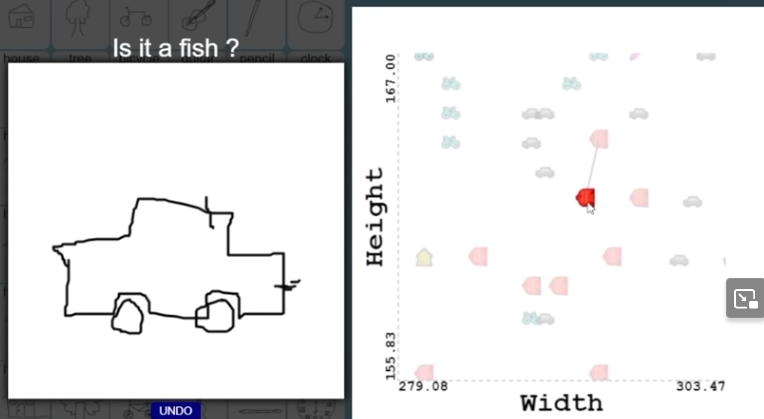
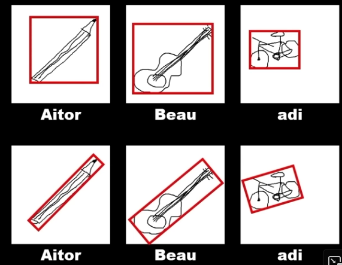

Follow along to the no-black-box machine learning course by @radu on freecodecamp

Raw and derived data is not included in the repo as it doesn't have any license: https://github.com/gniziemazity/drawing-data

# No black box ML Part 1 (Videos 1-9)

Notes:

- methods starting with `#` are private in JS (ES2015+). Never knew.
- When visualizing data and nearest neighbour, be aware that a sample might **look** closer to another sample because the pixelspace in the chart is (or can be) squished together and in dataspace another point might actually be nearer!
- Data scaling:
  - Normalization: remap values to values between 0-1

## Dealing with outliers

- remove
- standardization: calculate mean and standard deviation and subtract mean and divide by standard deviation

## Classifiers

K nearest neighbors (where K is the number of nearest neighbors), where the class is decided on the majority of the k nearest neighbors

## Homework

### 2 new features

- general orientation (e.g. guitars and pencils have mostly a horizontal orientation, trees vertical, fish and cars horizontal, clocks no discernable)
- points in longest single stroke (e.g. clock would mostly have one long stroke for the circle)

### rotate bounding box

Currently, the width and height features are calculated on a horizontal bounding box. Alter the functions in featureFunctions to rotate the bounding box so it applies only to the drawing area (I can't formulate it better right now):

# Exkurs

## Chart library

